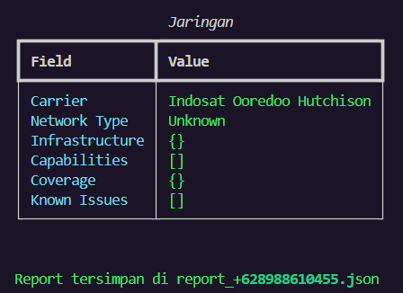
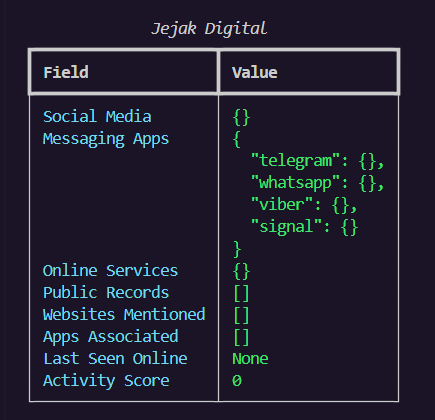

<div align="center">

# 📱 PhoneDetective
### Powerful Phone Number OSINT Tool

[Features](#features) • [Installation](#installation) • [Usage](#usage) • [Examples](#examples) • [Contributing](#contributing)





</div>

---

## 🔍 About PhoneDetective

PhoneDetective is an OSINT (Open Source Intelligence) tool designed to uncover hidden information behind phone numbers in a simple way. With an intuitive interface, PhoneDetective helps you gather intelligence from various open sources.

## ✨ Key Features

🔹 **Validation**
- Automatic phone number format detection
- Real-time validation for accuracy
- National Format (Indonesia)

🔹 **Analysis**
- Mobile provider identification
- Geographic location detection
- Number registration history

🔹 **Reports**
- Export results in JSON format
- Interactive data visualization
- Structured analysis summary

## 🚀 Getting Started

### Prerequisites
- Python 3.6+
- pip (Python package installer)
- Internet connection

### Quick Installation

```bash
# Clone repository
https://github.com/rexzea/PhoneDetective.git

# Change directory
cd osint-telp
```

## 💡 Usage

### 1. Run with Python terminal

### 2. Interactive Mode
```python
              Basic Information
┏━━━━━━━━━━━━━━━━━━━━━━┳━━━━━━━━━━━━━━━━━━┓
┃ Field                ┃ Value            ┃
┡━━━━━━━━━━━━━━━━━━━━━━╇━━━━━━━━━━━━━━━━━━┩
│ International Format │ +62 898-8610-455 │
│ National Format      │ 0898-8610-455    │
│ E164 Format         │ +628988610455    │
│ Country Code        │ +62              │       #My Phone Number
│ National Number     │ 8988610455       │
│ Type                │ 1                │
│ Valid               │ True             │
│ Possible            │ True             │
└──────────────────────┴──────────────────┘
```

### 3. 📊 Example Output (JSON)

```json
{
  "number": "+62812XXXXX",
  "valid": true,
  "provider": "Telkomsel",
  "location": {
    "province": "DKI Jakarta",
    "region": "Indonesia"
  },
  "risk_score": 0.2,
  "last_seen": "2024-12-15"
}
```

## 🤝 Contributing

We greatly appreciate your contributions! Here's how you can help:

1. 🍴 Fork this repository
2. 🌿 Create a feature branch (`git checkout -b new-feature`)
3. 💫 Commit your changes (`git commit -m 'Add new feature'`)
4. 🚀 Push to the branch (`git push origin new-feature`)
5. 🎉 Create a Pull Request

## 📜 License

This project is licensed under the MIT License - see the [LICENSE](LICENSE) file for details.

## 🌟 Support

Love PhoneDetective? Give it a ⭐️ on GitHub!